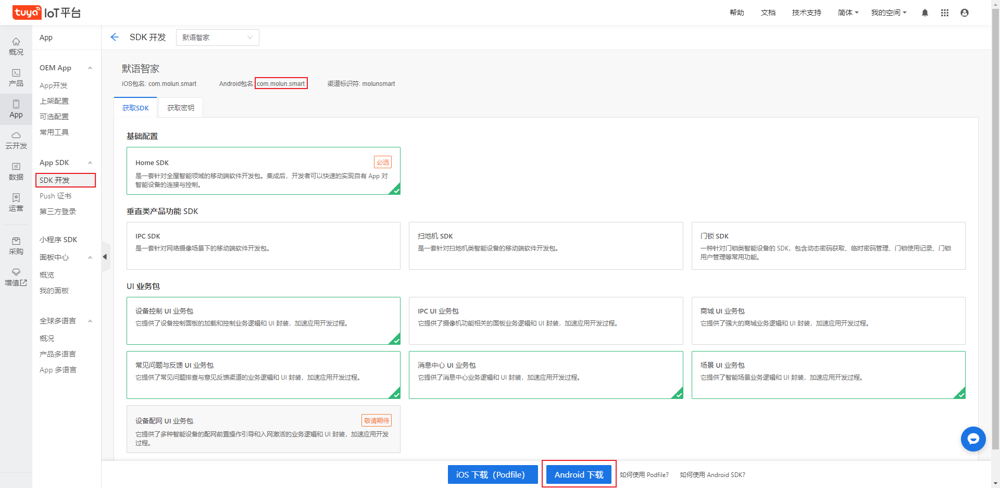
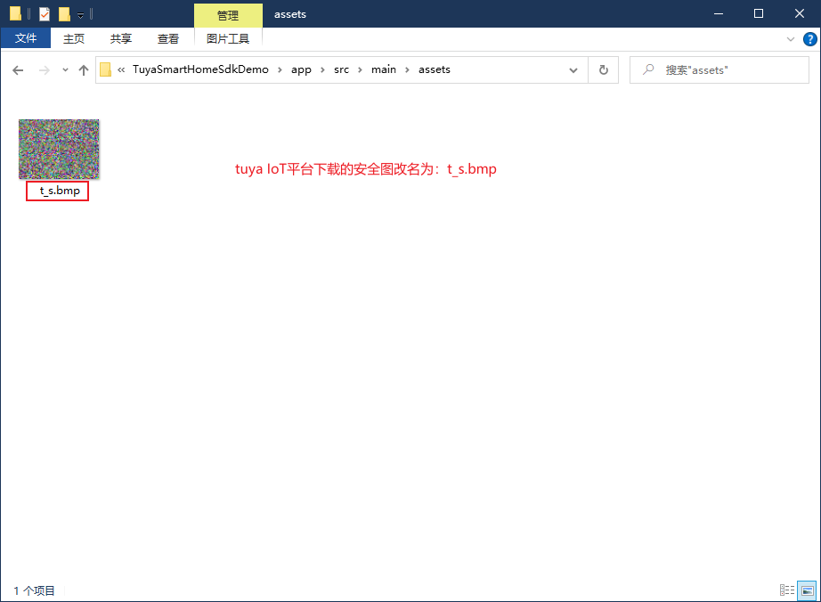

# 项目说明 Project Description

该项目是使用Tuya App SDK开发的，它使您能够快速开发品牌的应用程序，以连接和控制许多设备的智能场景。更多信息，请访问[涂鸦开发者网站](https://developer.tuya.com/en/docs/iot/app-development/sdk-development/app-sdk-instruction?id=K9kjstc7t376p).
This project is developed using Tuya App SDK, which enables you to quickly develop branded apps connecting and controlling smart scenarios of many devices. 
For more information, please check [Tuya Developer Website](https://developer.tuya.com/en/docs/iot/app-development/sdk-development/app-sdk-instruction?id=K9kjstc7t376p).

# 如何使用 How to use

